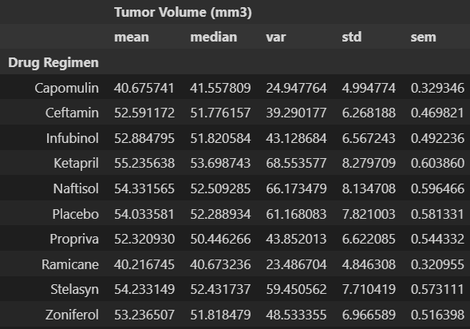
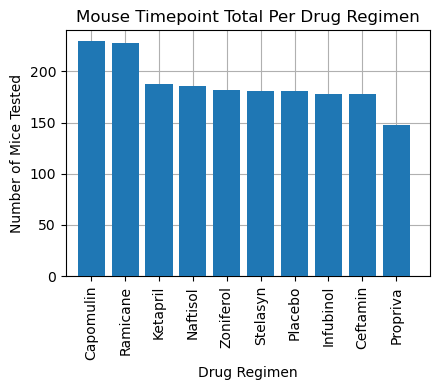
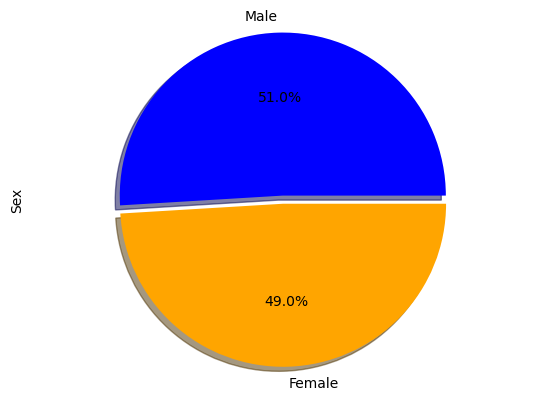
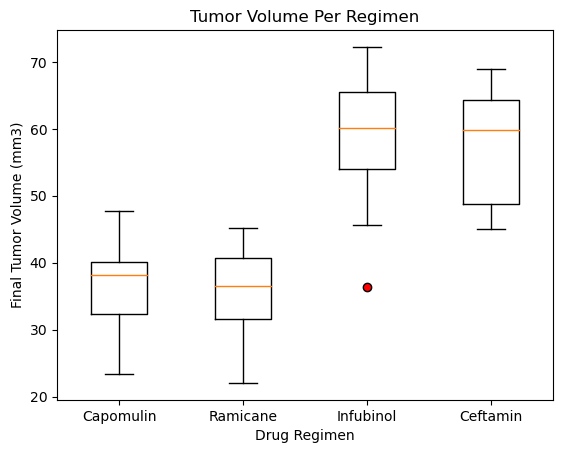
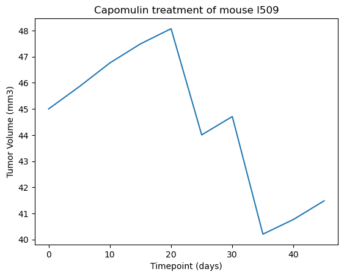
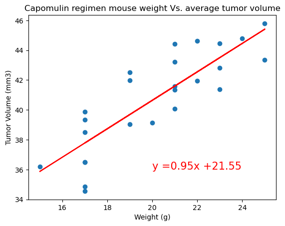

# Module-5-Challenge

## Pymaceuticals Inc.

As the senior data analyst at Pymaceuticals Inc you have been tasked with reviewing the data from the most recent animal study beta testing new drug regimens to combat skin cancer.I do not agree with animal testing personally, but this is a ficticious assignment so have fun with it.

During this study we want to compare performances of all drug regimens while paying close attention to the regimen of interest, Capomulin.

We will receive all data from our research team to compile an analysis with visuals to present to the executive team.

--------------------------------------------------------------------------

- Before we get to the Charts and graphs we can see from the Tumor Volume Mean and Standard deviatian that Capomulin and Ramicane have had the most successful trials.

---------------------------------------------------------------------------

- From the Bar charts we can see that Capomulin and Ramicane were tested on the majority of the mice, which begins to validate our data for our previous statement.

---------------------------------------------------------------------------

- From the Pie chart we can determine that the gender was fairly close to being balanced with 51% male mice and 49% female mice. However, this does not give us a sound reference that all drug regimens were tested evenly across male and female mice.

---------------------------------------------------------------------------

- From the Box Plot and the previous analysis statements we can determine that Capomulin and Ramicane had the higher success rates with the lowest final tumor volume averages. 

---------------------------------------------------------------------------

- When we randomly selected Mouse L509 we can see the effect of Capomulin with a 7.8% Tumor decrease over the course of 45 days. 

---------------------------------------------------------------------------

- We were able to find a positive correlation between the mouse weight and the average tumor volume. This tells us that when the weight of the mouse increases, our tumor size increases as well

- Our Linear regression model shows us that our dependant variable (Tumor Volume) increases as our independant variable (Weight (g)) increases. From the positive slope this gives us a way to predict and track larger subjects to test Capomulin. 
 
